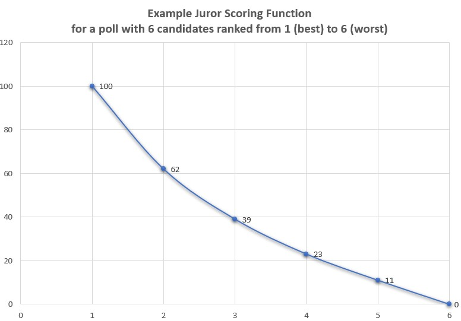

# Voord - Hackaway v5

**Voord** is an app for preferential order-based voting created by Matt Tantony at the Royal Hackaway, 5-6 February 2022.

It's a .NET 6 console app that lets people create and vote on multiple-choice polls. You cast your vote by putting all the candidates in preferential order (from worst to best). The app uses a log function to convert the jurors' preferences into points and determine the poll winner. This app was inspired by the voting method used by the international juries in the Eurovision Song Contest.

**VO**ting + **ORD**er = **VOORD**.

A Voord is also this faintly sinister *Doctor Who* monster from the 1960s:

## Table of Contents
* [Technologies](#technologies)
* [How to Use](#how-to-use)
  * [Create a Poll](#create-a-poll)
  * [Get the Names of All Available Polls](#get-the-names-of-all-available-polls)
  * [Vote in a Poll](#vote-in-a-poll)
  * [View Poll Results](#view-poll-results)

## The Scoring Algorithm
As mentioned above, a juror votes in a poll by ranking all the candidates in preferential order from worst to best. Their preferences are converted into points using a simple log function:

In a poll of _n_ candidates, if a juror awards candidate _c_ a rank of _r_, the candidate is awarded _y_ points, where

y = 100 - (100 * (Log (base n) r)

For example, in a poll with 6 candidates, the juror's rankings are converted into points as shown on the graph below.

This means that the first placed (i.e. 1st) candidate gets 100 points, the last placed (i,e. 6th) candidate gets 0 points, and the intermediate candidates are assigned points across a logarithmic distribution.

## Technologies

This project uses **.NET 6** and **C# 10**. The source code requires of the following 3rd-party libraries (all accessible through NuGet):

 - [CsvHelper](https://joshclose.github.io/CsvHelper/) 27.2.1
 - [Spectre.Console](https://spectreconsole.net/) 0.43.0
 - [System.IO.Abstractions](https://www.nuget.org/packages/System.IO.Abstractions) 16.1.4

Since I don't yet know how to work with a relational database in C#, the app's data persistence is managed using a single JSON file. The app's `IDataGateway` service is designed in such a way that the app is completely unaware of how data persistence is managed, and the JSON implementation could be switched out with a relational database at a later date.

## How to Use

The app is run from the command line, with four simple commands that will be explained in this section.

First, make sure you have [Git](https://git-scm.com/) and [.NET 6](https://dotnet.microsoft.com/en-us/download) installed on your computer. Then, from the command line...

Clone the repo and navigate into it

    $ git clone https://github.com/MattSortsThings/voord
    $ cd voord

Build the Voord App project to a directory of your choice using the .NET CLI. For example:

    $ dotnet build src/MJT.Voord.VoordApp -o C:\Users\example\voordDirectory

Navigate to the build directory then run the `MJT.Voord.VoordApp.exe` executable, with additional arguments as shown below:

### Create a Poll

You will need a .csv file with the poll candidate names in a single column, with the header "Names".

Run the app with the `create` arg followed by the name of the new poll and the path to the .csv file, e.g.:

  $ MJT.Voord.VoordApp.exe create staff-outing example-poll-staff-outing.csv

### Get the Names of All Available Polls

Run the app with the `names` arg to see the names of all polls available to vote on.

  $ MJT.Voord.VoordApp.exe names

### Vote in a Poll

Run the app with the `vote` arg followed by the name of the existing poll and the juror's name.

  $ MJT.Voord.VoordApp.exe staff-outing Matt

### View Poll Results

Polls are always 'open' and jurors can add more votes at any time. To view the current results of a poll, run the app with the `view` arg followed by the name of the poll.

  $ MJT.Voord.VoordApp.exe staff-outing
